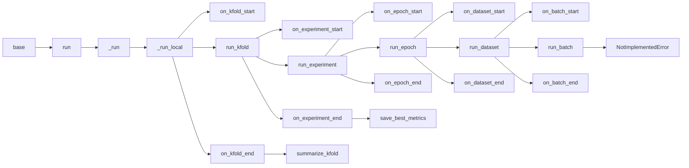
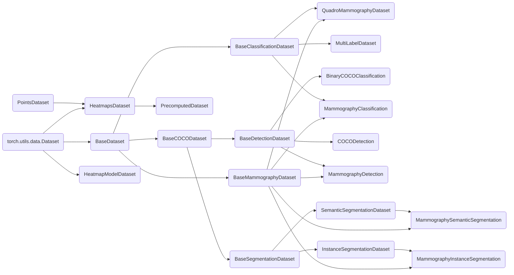

# neurone

## Requirements

Python 3.10

## Installation
```
pip install -e .
git lfs pull
```

## Normalization

Скрипт для получения `mean/std` к датасету, указанному в конфиге.

```bash
python tools/get_mean_std.py <path_to_config> --engine=<engine_name> --cuda=<cuda_number>
```

## Grad-cam

```bash
python tools/grad_cam.py <path_to_config> --weights-path=<path_to_model_weight> --dir=<dir_to_save_results> --engine=<engine_name> --cuda=<cuda_number>
```

Рабочий пример на a100:
```bash
python tools/grad_cam.py configs/inbreast.yaml --weights-path='/home/mammography_data/models/INBreast/EfficientNet_B3_full/experiment_2023-03-31 19:22:01.251700/model.pth' --dir='tmp/grad_cam' --engine=gpu --cuda='0'
```

Изображения будут находится в директории `<dir_to_save_results>`.

## Train
Run from the root of this project:
```bash
python tools/train_torch.py test/supplement/classification.json
```

## Base structure



## Dataset hierarchy


## TYFC
Run from the root of this project:
```
pytest
```
You are awesome!